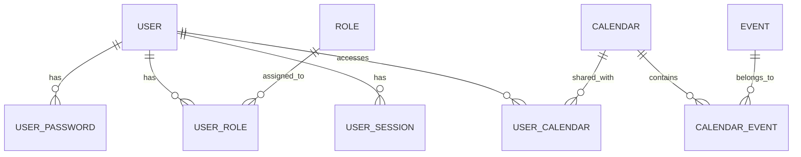

<div align="center">
  
  <p><em>API RESTful moderne pour la gestion de calendriers et d'événements</em></p>
</div>

<div align="center">

[](https://sonarcloud.io/summary/new_code?id=herradiamine_GoLendar)
[](https://sonarcloud.io/summary/new_code?id=herradiamine_GoLendar)
[](https://sonarcloud.io/summary/new_code?id=herradiamine_GoLendar)
[](https://sonarcloud.io/summary/new_code?id=herradiamine_GoLendar)
[](https://go.dev/)
[](LICENSE)

</div>

---

## 📋 Table des matières

- [🎯 Présentation](#-présentation)
- [🚀 Fonctionnalités](#-fonctionnalités)
- [🏗️ Architecture](#️-architecture)
- [📦 Installation](#-installation)
- [🔧 Configuration](#-configuration)
- [📚 API Documentation](#-api-documentation)
- [🧪 Tests](#-tests)
- [🔍 Qualité du code](#-qualité-du-code)
- [📂 Structure du projet](#-structure-du-projet)
- [🤝 Contribution](#-contribution)
- [📄 Licence](#-licence)

---

## 🎯 Présentation

**GoLendar** est une API RESTful moderne et sécurisée écrite en Go pour la gestion complète de calendriers et d'événements. Conçue avec une architecture modulaire, elle offre une solution robuste pour les applications nécessitant une gestion de calendriers avec authentification et contrôle d'accès.

### ✨ Caractéristiques principales

- 🔐 **Sécurité avancée** : Authentification par sessions, gestion des tokens, contrôle d'accès par rôles
- 📅 **Gestion complète** : Calendriers, événements, utilisateurs et leurs relations
- 🏗️ **Architecture modulaire** : Code organisé et maintenable
- 🧪 **Tests complets** : Tests unitaires et d'intégration
- 🐳 **Déploiement Docker** : Configuration multi-stage optimisée
- 📊 **Monitoring** : Intégration SonarCloud pour la qualité du code

### 🛠️ Stack technique

| Composant | Version | Description |
|-----------|---------|-------------|
| **Go** | 1.24+ | Langage principal |
| **MySQL** | 8.0 | Base de données |
| **Gin** | 1.10+ | Framework web |
| **Docker** | - | Conteneurisation |
| **SonarCloud** | - | Analyse de qualité |

---

## 🚀 Fonctionnalités

### 👥 Gestion des utilisateurs
- ✅ Inscription et authentification sécurisée
- ✅ Gestion des sessions avec tokens et refresh tokens
- ✅ Système de rôles et permissions
- ✅ Profils utilisateur personnalisables

### 📅 Gestion des calendriers
- ✅ Création et gestion de calendriers
- ✅ Association utilisateurs/calendriers
- ✅ Permissions d'accès granulaires
- ✅ Calendriers partagés

### 📝 Gestion des événements
- ✅ CRUD complet des événements
- ✅ Filtrage par période (jour/semaine/mois)
- ✅ Gestion des événements annulés
- ✅ Durée et horodatage précis

### 🔐 Sécurité
- ✅ Authentification par sessions sécurisées
- ✅ Tokens de session et refresh tokens
- ✅ Contrôle d'accès par rôles
- ✅ Validation stricte des entrées
- ✅ Logging de sécurité

---

## 🏗️ Architecture

### Structure modulaire

```
GoLendar/
├── cmd/app/              # Point d'entrée de l'application
├── internal/             # Code métier (non exportable)
│   ├── calendar/         # Logique des calendriers
│   ├── calendar_event/   # Logique des événements
│   ├── common/           # Utilitaires partagés
│   ├── middleware/       # Middlewares HTTP
│   ├── routes/           # Définition des routes
│   ├── session/          # Gestion des sessions
│   ├── role/             # Gestion des rôles
│   ├── user/             # Logique des utilisateurs
│   └── user_calendar/    # Relations utilisateur/calendrier
├── resources/            # Ressources (SQL, Postman)
├── scripts/              # Scripts utilitaires
├── testutils/            # Utilitaires de test
└── assets/               # Fichiers statiques
```

### Modèle de données



---

## 📦 Installation

### Prérequis

- [Go 1.24+](https://go.dev/dl/)
- [Docker](https://www.docker.com/) & [Docker Compose](https://docs.docker.com/compose/)
- [Git](https://git-scm.com/)

### Installation rapide

```bash
# 1. Cloner le projet
git clone <url-du-repo>
cd GoLendar

# 2. Lancer avec Docker (recommandé)
./scripts/build.sh

# 3. Vérifier l'installation
curl http://localhost:8080/health
```

### Installation manuelle

```bash
# 1. Installer les dépendances
go mod download

# 2. Configurer la base de données MySQL
# Assurez-vous que MySQL tourne sur localhost:3306

# 3. Lancer l'application
go run cmd/app/main.go
```

### Variables d'environnement

| Variable | Défaut | Description |
|----------|--------|-------------|
| `DB_HOST` | `golendar_db` | Hôte de la base de données |
| `DB_PORT` | `3306` | Port de la base de données |
| `DB_USER` | `root` | Utilisateur de la base de données |
| `DB_PASSWORD` | `password` | Mot de passe de la base de données |
| `DB_NAME` | `calendar` | Nom de la base de données |

---

## 🔧 Configuration

### Configuration de la base de données

Le schéma de base de données est automatiquement créé lors du premier lancement. Vous pouvez le personnaliser dans `resources/schema.sql`.

### Configuration SonarCloud

Pour l'analyse de qualité du code :

```bash
# 1. Obtenir un token SonarCloud
# Allez sur https://sonarcloud.io/account/security/

# 2. Configurer le token
export SONAR_TOKEN=votre_token

# 3. Lancer l'analyse
./scripts/sonar.sh
```

---

## 📚 API Documentation

### Endpoints principaux

#### 🔐 Authentification
```http
POST /auth/login          # Connexion
POST /auth/refresh        # Renouvellement de token
POST /auth/logout         # Déconnexion
GET  /auth/me             # Profil utilisateur
```

#### 👥 Utilisateurs
```http
POST   /user              # Créer un utilisateur
GET    /user/me           # Mon profil
PUT    /user/me           # Modifier mon profil
DELETE /user/me           # Supprimer mon compte
```

#### 📅 Calendriers
```http
POST   /calendar          # Créer un calendrier
GET    /calendar/:id      # Obtenir un calendrier
PUT    /calendar/:id      # Modifier un calendrier
DELETE /calendar/:id      # Supprimer un calendrier
```

#### 📝 Événements
```http
POST   /calendar-event/:calendar_id                    # Créer un événement
GET    /calendar-event/:calendar_id/:event_id         # Obtenir un événement
PUT    /calendar-event/:calendar_id/:event_id         # Modifier un événement
DELETE /calendar-event/:calendar_id/:event_id         # Supprimer un événement
GET    /calendar-event/:calendar_id/month/:year/:month # Événements du mois
GET    /calendar-event/:calendar_id/week/:year/:week   # Événements de la semaine
GET    /calendar-event/:calendar_id/day/:year/:month/:day # Événements du jour
```

### Exemples d'utilisation

#### Créer un utilisateur
```bash
curl -X POST http://localhost:8080/user \
  -H "Content-Type: application/json" \
  -d '{
    "firstname": "John",
    "lastname": "Doe",
    "email": "john.doe@example.com",
    "password": "password123"
  }'
```

#### Se connecter
```bash
curl -X POST http://localhost:8080/auth/login \
  -H "Content-Type: application/json" \
  -d '{
    "email": "john.doe@example.com",
    "password": "password123"
  }'
```

#### Créer un événement
```bash
curl -X POST http://localhost:8080/calendar-event/1 \
  -H "Content-Type: application/json" \
  -H "Authorization: Bearer YOUR_SESSION_TOKEN" \
  -d '{
    "title": "Réunion équipe",
    "description": "Réunion hebdomadaire",
    "start": "2024-01-15T10:00:00Z",
    "duration": 60
  }'
```

### Collection Postman

Une collection Postman complète est disponible dans `resources/postman_collection.json` pour tester tous les endpoints.

---

## 🧪 Tests

### Exécuter les tests

```bash
# Tests unitaires avec couverture
go test -cover ./...

# Tests avec rapport détaillé
go test -v ./...

# Tests d'un package spécifique
go test ./internal/user/

# Tests avec race detector
go test -race ./...
```

### Amélioration de la couverture

Pour améliorer la couverture de tests :

```bash
# Générer un rapport de couverture HTML
go test -coverprofile=coverage.out ./...
go tool cover -html=coverage.out -o coverage.html
```

---

## 🔍 Qualité du code

### SonarCloud

Le projet est intégré avec SonarCloud pour l'analyse continue de la qualité du code :

- **Quality Gate** : Vérification automatique de la qualité
- **Couverture** : Suivi de la couverture de tests
- **Security Rating** : Évaluation de la sécurité
- **Technical Debt** : Dette technique

### Bonnes pratiques appliquées

- ✅ **Séparation des responsabilités** : Architecture modulaire
- ✅ **Validation des entrées** : Middlewares de validation
- ✅ **Gestion d'erreurs** : Centralisation des messages
- ✅ **Logging structuré** : Utilisation de slog
- ✅ **Tests unitaires** : Couverture de code
- ✅ **Configuration externalisée** : Variables d'environnement
- ✅ **Sécurité** : Authentification et autorisation
- ✅ **Documentation** : README et commentaires

---

## 📂 Structure du projet

```
GoLendar/
├── 📁 assets/                    # Fichiers statiques
│   ├── GoLendar-Logo.png        # Logo du projet
│   └── banniere_golendar_v2.png # Bannière
├── 📁 cmd/
│   └── 📁 app/
│       └── main.go              # Point d'entrée
├── 📁 internal/                 # Code métier
│   ├── 📁 calendar/             # Gestion des calendriers
│   ├── 📁 calendar_event/       # Gestion des événements
│   ├── 📁 common/               # Utilitaires partagés
│   ├── 📁 middleware/           # Middlewares HTTP
│   ├── 📁 role/                 # Gestion des rôles
│   ├── 📁 routes/               # Définition des routes
│   ├── 📁 session/              # Gestion des sessions
│   ├── 📁 user/                 # Gestion des utilisateurs
│   └── 📁 user_calendar/        # Relations utilisateur/calendrier
├── 📁 resources/                # Ressources
│   ├── postman_collection.json  # Collection Postman
│   └── schema.sql              # Schéma de base de données
├── 📁 scripts/                  # Scripts utilitaires
│   ├── build.sh                # Script de build
│   └── sonar.sh                # Script d'analyse SonarCloud
├── 📁 testutils/                # Utilitaires de test
├── 📁 .github/                  # Configuration GitHub
│   └── 📁 workflows/           # GitHub Actions
├── 📁 logs/                     # Fichiers de logs
├── 📁 reports/                  # Rapports
├── 📄 .dockerignore            # Exclusions Docker
├── 📄 .gitignore               # Exclusions Git
├── 📄 docker-compose.yml       # Configuration Docker
├── 📄 Dockerfile               # Build Docker
├── 📄 go.mod                   # Dépendances Go
├── 📄 go.sum                   # Checksums des dépendances
├── 📄 README.md                # Documentation
└── 📄 sonar-project.properties # Configuration SonarCloud
```

---

## 🤝 Contribution

### Comment contribuer

1. **Fork** le projet
2. **Créez** une branche pour votre fonctionnalité (`git checkout -b feature/AmazingFeature`)
3. **Commitez** vos changements (`git commit -m 'Add some AmazingFeature'`)
4. **Poussez** vers la branche (`git push origin feature/AmazingFeature`)
5. **Ouvrez** une Pull Request

### Standards de code

- Suivez les conventions Go
- Ajoutez des tests pour les nouvelles fonctionnalités
- Maintenez la couverture de tests > 80%
- Documentez les nouvelles API
- Vérifiez que tous les tests passent

### Workflow de développement

```bash
# 1. Cloner le projet
git clone <url-du-repo>
cd GoLendar

# 2. Installer les dépendances
go mod download

# 3. Lancer les tests
go test ./...

# 4. Lancer l'analyse SonarCloud
./scripts/sonar.sh

# 5. Vérifier la qualité du code
# Consultez les résultats sur SonarCloud
```

---

## 📄 Licence

Ce projet est sous licence MIT. Voir le fichier [LICENSE](LICENSE) pour plus de détails.

---

<div align="center">

**Auteur** : [Amine HERRADI](https://github.com/herradiamine)

[](https://github.com/herradiamine)

*Fait avec ❤️ en Go*

</div> 